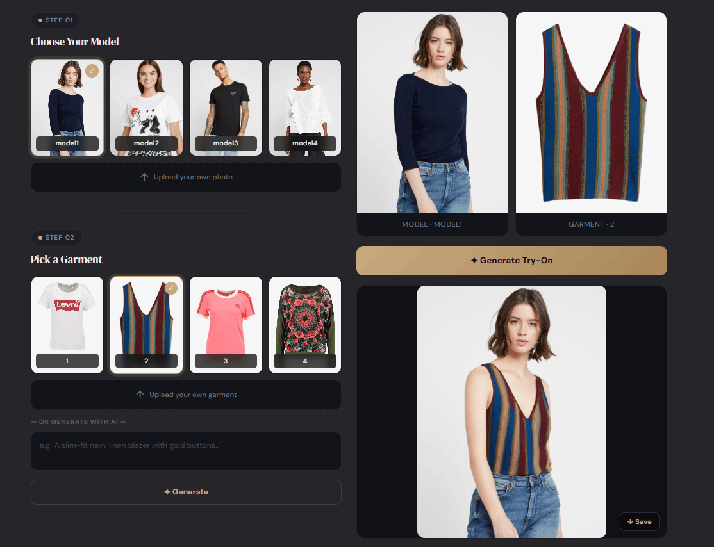

# AI Virtual Fashion Try On Using Generative AI

An AI-powered Virtual Try-On (VTO) system that bridges the gap in digital fashion retail by allowing users to visualize how clothing items look on their body structure. The system supports multimodal inputs, accepting either a physical clothing image or a natural language text prompt to generate realistic, view-consistent try-on outputs.

---

## 👥 Contributors (Batch 2078 BCT)

- **Deepa Gyawali** (KCE078BCT011)
- **Kismat Poudel** (KCE078BCT022)
- **Pragun Bhandari** (KCE078BCT028)
- **Sejal Dahal** (KCE078BCT037)

**Supervised by:** Er. Ayush Adhikari (CTO, Co-founder at DeepMinds Inc.)  
**Institution:** Department of Computer and Electronics Engineering, Khwopa College of Engineering

---

## 🚀 Core Features

- **Multimodal Input Flexibility:** Upload a personal portrait alongside a target garment image OR type a descriptive text prompt (e.g., _"white oversized hoodie"_).
- **Intelligent Pre-processing:** Automated human body pose estimation (DensePose) and multi-scale semantic image segmentation (Human Parsing).
- **High-Fidelity Garment Alignment:** Uses advanced latent diffusion networks to accurately scale, warp, and deform clothing textures to match individual postures naturally.
- **State-of-the-Art Realism:** Achieved a highly competitive **Fréchet Inception Distance (FID) score of 3.09**, delivering outstanding texture retention and structural fidelity.

---

## 🛠️ Architecture & Tech Stack

### Machine Learning Pipeline

- **Pose Estimation & Segmentation:** Keypoint landmark extraction and human parsing masks to build clothing-agnostic body maps.
- **Text-to-Clothing Generation:** Stable Diffusion fine-tuned via **LoRA (Low-Rank Adaptation)** to encode text descriptions into realistic garments.
- **Virtual Try-On Core Engine:** Built upon **CatVTON** and **VITON-HD** pipelines for feature matching, texture preservation, and seamless blending.

### Software Engineering Stack

- **Frontend:** React.js, Tailwind CSS (Responsive grid layouts, interactive preview tiles).
- **Backend:** Flask (Python lightweight framework), configured with CORS and RESTful API endpoints.

---

## 📊 Key Hyperparameters Used

| Component / Model    | Hyperparameter       | Value                                          |
| :------------------- | :------------------- | :--------------------------------------------- |
| **VITON-HD**         | Input Resolution     | 1024 × 768 pixels                              |
| **VITON-HD**         | Optimizer            | Adam ($\beta_1 = 0.5, \beta_2 = 0.999$)        |
| **Stable Diffusion** | Effective Batch Size | 16 (Batch size 4 $\times$ Grad Accum 4)        |
| **Stable Diffusion** | Training Schedule    | 15 Epochs @ Learning Rate $1 \times 10^{-4}$   |
| **LoRA**             | Configuration        | Rank ($r$) = 8, Alpha = 16                     |
| **CatVTON**          | Training Resolution  | 512 × 384 pixels                               |
| **CatVTON**          | Optimizer            | AdamW 8-bit @ Learning Rate $1 \times 10^{-5}$ |

---

## 🖼️ Application User Interface (UI)

The web platform provides an interactive dashboard allowing users to upload a model, input a clothing asset, and generate high-fidelity try-on results seamlessly in real-time.

  

